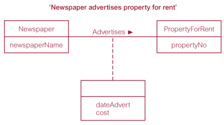

# Chapter 12
**Entity-Relationship: a top-down database design approach**

步骤：确定实体以及实体间的关系，再自顶向下细化更小的实体对象

**Concepts**
* Entity types, 如 staff, student等
* Relationship types, 如一个staff管理多个student
* Attributes 如 staff name等

**Entity Type - the basic concept of ER model**

* 具有相同属性的一组对象
* 每个可单独识别的对象（uniquely identifiable object）称为 ***entity occurence***
  * Strong ~: 不依赖于其他实体类（not existence-dependent）
  * Weak ~: 部分或全部（partially or totally）依赖于其他实体类，必须有一个强制的 (mandatory) 外键 （即外键不能为空）

**Relationship Occurence:** A uniquely identifiable association which includes one occurrence from each participating entity type （一个或多个实体类型间的一种关系）

***A relationship name should be unique for a given ER model.***

**Degree of relationship type:** Number of participating entity types (or called participants) 包含在某个联系类型中的实体
one = recursive/unary, two = binary, three = ternary

Recursive relationship may be given ***role names*** to indicate the purpose that each participating entity type plays in a relationship.

**Simple Attribute:** 不可被划分的单个属性，如id

**Composite Attribute:** 可被划分的属性，如地址

**Single-valued Attribute:** 只能有唯一一个值 

**Multi-valued Attribute:** 可有多个值

**Derived Attribute:** 属性的值是从相关的一个或一组属性的值计算出来的属性，如学生总人数。

The decision to store derived attributes in database  tables depends on ***the processing requirements*** and ***the constraints placed on a particular application***

若两张表的关系有中间属性，画图为：

**Multiplicity:** Main type of constraint on relationships is called multiplicity

* Number (or range) of possible occurrences of an  entity type that may relate to a single occurrence of  an associated entity type through a particular  relationship. 可能事件出现的范围，关系到通过特定关系关联的，某个实体的单个事件
