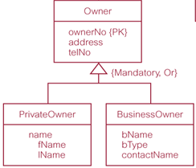

# Chapter 13

**Specialization  / Generalization:** Most useful additional data modeling concept of  Enhanced ER (EER) model.

Associated with superclasses, subclasses, and the process of attribute inheritance.

**Superclass:** An entity type that includes one or more distinct  subgroupings of its occurrences. 包含出现的不同的子组

**Subclass: **A distinct subgrouping of occurrences of an  entity type 一个实体类型的不同的子组

A subclass with more than one superclass is called  a ***shared subclass***.

An entity and its subclasses, and their subclasses,  and so on, is called a ***type hierarchy***.

**Generalization process:**

* Process of ***identifying their common  characteristics*** among entities.

* Results in the identification of a ***generalized  superclass*** from the original entity types.

  

**Specialization process:**

* Process of ***maximizing differences*** between  members of an entity by identifying their  distinguishing characteristics.

* Defining a set of superclasses first, then by defining  differences between members of an entity, related ***subclasses*** are identified.

  

***Participation constraint:***
* Determines **whether** every member in superclass  **must participate** as a member of a subclass.
* Represented as ***{Mandatory}*** and ***{Optional}*** respectively.

***Disjoint constraint:***

* Describes relationship between members of the  subclasses as whether **overlapping exists** 

  子类成员与父类的关系是否能重复出现

* Indicates whether member of a superclass can  be a member of one ***{Or}*** , or more than one,  subclass ***{And}***